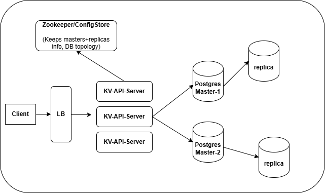

##### KV Store with storage engine as SQL database.



**Operations:**
1) PUT (K, V, TTL)
   ```
   INSERT INTO kvstore (key, value, expiry) VALUES (?, ?, ?) ON CONFLICT(key) DO UPDATE SET value = ?, expiry = ?
   ```
2) GET(K)
   ```
   SELECT value FROM kvstore WHERE key=? and expiry > now()
   ```
3) DEL(K)
    ```
    UPDATE kvstore SET expiry = null WHERE key = ? and expiry > now()
    ```
4) Periodic Cleanup (Batch delete)
    ```
   DELETE FROM kvstore WHERE key IN
       (SELECT key FROM kvstore WHERE expiry is null or expiry <= now() limit 100)
   ```


##### Design:
1. Master database is shared, range based on key values (kept at Zookeeper or some config store) for scaling writes.
2. Replicas are added to each master shard for scaling reads.
3. API servers are elastic for handling increased/decreased load. 
